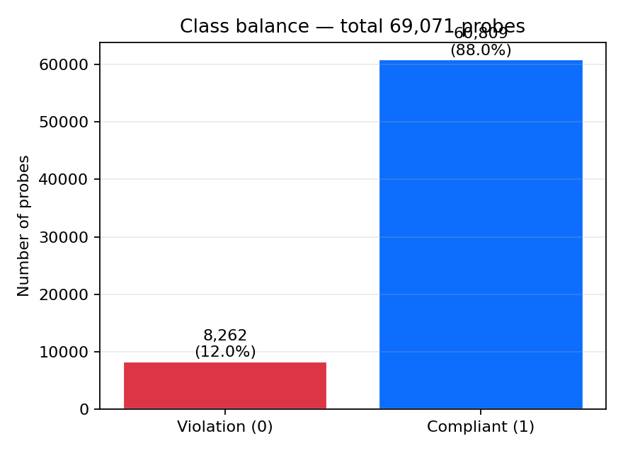
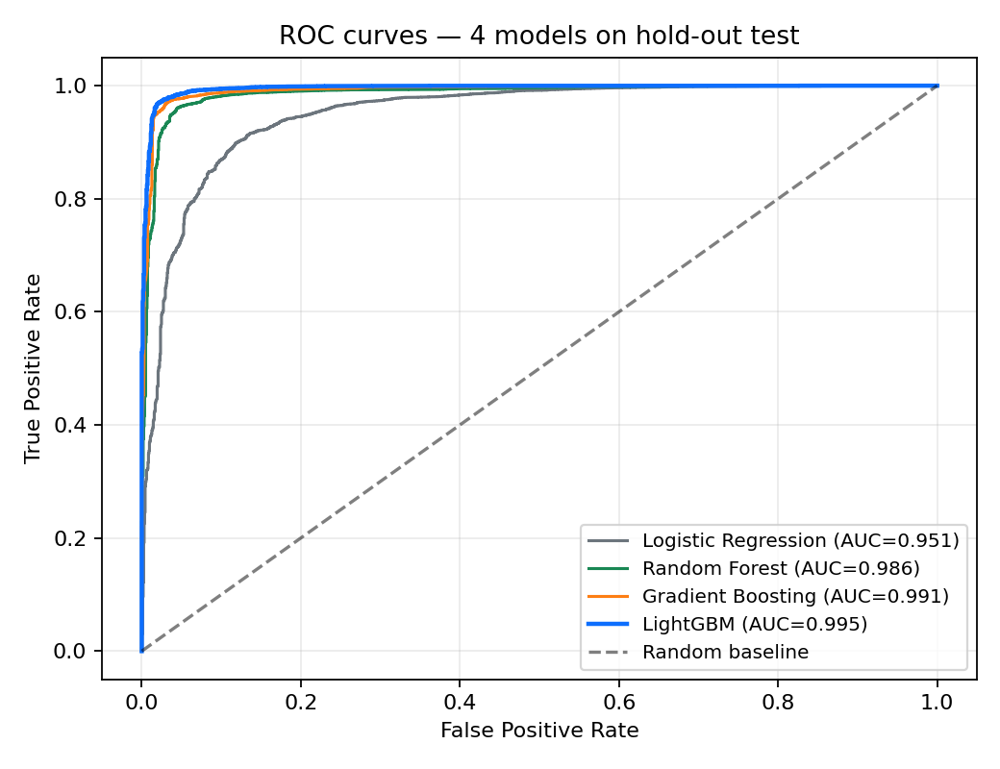

# 1. Probleem ja eesmärk

Terviseamet avaldab Eesti veeproovide laboratoorseid tulemusi avaandmetena
(supluskoht, ühisveevärk, basseinid, joogiveeallikad). Iga proovi kohta on
fikseeritud mikrobioloogilised ja keemilised näitajad ning ametlik vastavuse
hinnang (`vastab` / `ei vasta`). Käsitsi ülevaatus on aeglane ja kallis.

Käesoleva projekti eesmärk on luua **binaarne klassifikaator**, mis ennustab
proovi vastavust normile mõõtmistulemuste põhjal, ning hinnata, **kui hästi
selline mudel sobib riskipõhise valiku tööriistana**. Tähtsaim mõõdik on
**recall klassi 0 (rikkumine) suhtes** — vale-negatiivne ennustus
("kõik korras", kui tegelikult mitte) seostub mikrobioloogiliste riskidega
(nt *E. coli*) ja on praktiliselt halvem kui vale-positiivne ("liigne alarm").

# 2. Andmed

Kasutame avaandmeid aadressilt **vtiav.sm.ee**, perioodist **2021–2026**, neljast
domeenist (`supluskoha`, `veevärk`, `basseinid`, `joogivesi`). Andmed laaditakse
ja parsitakse Pythonis (`src/data_loader.py`); kõik aastad kombineeritakse
ühte tabelisse.

| Suurus               | Väärtus      |
|---------------------:|-------------:|
| Proove kokku         | **69 071**   |
| Rikkumisi (klass 0)  | 8 262 (12,0 %) |
| Vastab normile (1)   | 60 809 (88,0 %) |
| Treening / test      | 55 256 / 13 815 (80/20 stratifitseeritud) |
| Tunnuseid pärast feature engineeringut | 70 |

Märkimisväärsed metoodilised aspektid:

* **Asukohtade dedupliitseerimine.** Terviseamet nimetab samu objekte aastate
  vahel ümber (nt *Harku järve supluskoht* → *Harku järve rand*). Tehniline
  parandus `location_key` (lowercase + objekti-tüübi sufiksite eemaldus,
  `data_loader.normalize_location`) elimineerib pseudoduplikaadid.
* **Klasside tasakaalutus.** Lahendatud `class_weight="balanced"` ja lävendi
  optimeerimisega; **SMOTE-d ja sünteetilist üledisaktiivimist tahtlikult ei
  kasutatud**, et hoida vooluhulga kalibreeritust ja vältida sünteetiliste
  lähedaste-naabrite leket testkomplekti.
* **Pool-veenormide parandus.** Faasis 10 (andmete-kvaliteedi audit) avastasime,
  et meie esialgsed pool/spa-normid (vaba kloor [0,2; 0,6] mg/l) ei vasta
  Sotsiaalministri määrusele 49/2019, Lisa 4: õiged piirid on **[0,5; 1,5]
  mg/l** (vaba kloor) ja **≤ 0,5 mg/l** (seotud kloor). Pärast paranduse
  sisseviimist langes valede märgete arv 288 ning citizen-service'i agree-rate
  ametliku hinnanguga tõusis 81,5 %-lt 90,8 %-ni (+9,3 pp).

# 3. Metoodika

Kogu töövoog on dokumenteeritud kuues järjestikuses Jupyteri märkmikus
(`notebooks/01`–`06`):

1. **Tunnuste konstrueerimine** (`src/features.py`): toornäitajad + suhted normiga
   (`*_ratio`), ajalised tunnused (kuu, aasta, on-suvi), puuduva väärtuse
   indikaatorid (`*_missing`), domeen ja maakond (one-hot / fit-on-train,
   leket vältides).
2. **Imputeerimine ja skaleerimine** mediaaniga + `StandardScaler` —
   `fit` ainult treeningkomplektil.
3. **Mudelite võrdlus** neljal algoritmil (sklearn): Logistic Regression
   (baseline), Random Forest, Gradient Boosting, LightGBM.
4. **Lävendi optimeerimine.** `evaluate.best_threshold_max_recall_at_precision`
   maksimeerib recall klassi 0 jaoks tingimusel `precision ≥ 0,7`, kasutades
   PR-kõverat. Tavalävend 0,5 ei ole õige, kui FN-id maksavad rohkem kui FP-d.
5. **Kalibreerimine.** Isotooniline regressioon (`CalibratedClassifierCV`) viib
   ennustatud tõenäosused vastavusse tegelike sagedustega (vt joonist).
6. **Robustsus.** Lisaks juhuslikule splitile teostasime ajalise
   kross-valideerimise (`TimeSeriesSplit`, n=5) — metrikud jäävad samasse
   suurusjärku, mis kinnitab, et mudel ei õpi puhtalt aastapõhist mustrit.

# 4. Tulemused

{width=55%}

{width=70%}

| Mudel               | ROC-AUC | Recall (rikk.) | Precision (rikk.) | F1 (rikk.) |
|:--------------------|--------:|---------------:|------------------:|-----------:|
| Logistic Regression | 0,9509  | 0,8656         | 0,5757            | 0,6915     |
| Random Forest       | 0,9862  | 0,9207         | 0,8445            | 0,8810     |
| Gradient Boosting   | 0,9915  | 0,9619         | 0,8341            | 0,8934     |
| **LightGBM**        | **0,9954** | **0,9510**  | **0,9003**        | **0,9249** |

**LightGBM** annab parima tasakaalu: ROC-AUC 0,995, F1 (rikk.) 0,925, samas kui
Gradient Boosting saavutab pisut kõrgema rikkumiste recall'i (0,962) madalama
precision'i hinnaga (0,834). Tegevuses sõltub valik tagajärgede asümmeetriast
— vajadusel toetab `best_threshold_max_recall_at_precision` üleminekut ühe ja
teise vahel ilma ümberõppimiseta.

**SHAP-analüüsi** kohaselt (LightGBM, 800 testproovi alamvalim) on viis peamist
drivert: `iron_missing`, `combined_chlorine`, `free_chlorine`,
`colonies_37c_missing`, `ph_missing`. Tähelepanuväärne on **puuduvuse
indikaatorite domineerimine** — `*_missing` lipud kannavad infot proovi *tüübi*
kohta (basseini- vs joogiveeproovid mõõdavad erinevaid parameetreid) ja sellest
tuletatud baseline-riski. Tehnilised parameetrid (`coliforms`, `pH`,
`oxidizability`) järgnevad. See selgitab, miks iga eraldi tunnus ei pea olema
norme ületav, et mudel klassifitseeriks proovi rikkumiseks.

**Sesoonne signaal.** Suplusvee proovides on rikkumiste osakaal suvel umbes 4–5
korda kõrgem kui kevadel (vt `figures/seasonal_violations.png`).

# 5. Piirangud ja eetika

* **Sihtmuutuja on sisendi funktsioon.** Vastavuse hinnang tuleneb suuresti
  samade näitajate võrdlusest normidega — ROC-AUC > 0,99 peegeldab seetõttu
  ülesande **struktuuri**, mitte mudeli eraldiseisvat ennustusvõimet
  (vt `docs/ml_framing.md`).
* **Mudel ei mõõda vett.** Ta ei tuvasta loobunud või mõõtmata saasteaineid;
  ennustus kehtib ainult pärast laboriuuringut.
* **Avalike andmete täielikkus.** Faasi 10 audit leidis 2 164 proovi (3,1 %),
  kus ametlik hinnang on "rikkumine", kuid ükski avaldatud parameeter normi ei
  ületa. See viitab, et osa otsustest tugineb avaldamata andmetele
  (vt `docs/phase_10_findings.md`).
* **Põhjuslikkus puudub.** SHAP näitab näitaja panust ennustusse, mitte
  füüsikalist saastepõhjust.
* **Mudel ei prognoosi tulevikku.** Iga proov on punktmõõtmine; mudel
  klassifitseerib selle, mitte ei ennusta vee seisundit homme.

# 6. Praktiline rakendus

Tulemused on viidud avalikku teenusesse **[h2oatlas.ee](https://h2oatlas.ee)**:
2 196 asukoha interaktiivne kaart, kahe kihiga — *ametlik staatus* ja
*mudeli risk* (P(rikkumine) neljast mudelist valitavalt). Liides on
mitmekeelne (RU/ET/EN), lisab selgituse, et teenus **ei asenda ametlikku
hinnangut, ei ennusta tuleviku kvaliteeti ega anna meditsiinilisi soovitusi**.

# 7. Õppetunnid (vastus juhendaja märkusele)

Juhendaja juhtis tähelepanu, et **andmete töötlemine, klasside tasakaalutus ja
mitme mudeli võrdlus võivad nõuda rohkem aega kui algselt eeldatud**. Selle
peame kinnitama:

* **Skoobi haldus** — alustasime kahe domeeniga (`supluskoha`, `veevark`),
  laienesime nelja peale alles peale baastorustiku stabiliseerumist.
* **Andmete-kvaliteedi audit (Phase 10)** lisandus alles pärast esimese mudeli
  ootamatuid metrikuid — see avastas pool-normide vea ja aitas vältida vale
  järelduse "mudel ennustab paremini kui ametnik".
* **Tasakaalutus** lahendati kombinatsioonis (`class_weight="balanced"` +
  lävendi tuning), mitte sünteetilise üledisaktiivimisega — see hoiab
  kalibreerimise õigesti tõlgendatavana.

Kõik töövoog on reprodutseeritav: `python scripts/export_submission_figures.py`
(arvud) → `python scripts/build_presentation.py` (slaidid) →
`bash scripts/build_report_pdf.sh` (käesolev PDF).

---

*Viited: kõik joonised ja koondtabelid on kataloogis `submission/figures` ja
`submission/tables`. Mudelite valideerimise üksikasjad — `notebooks/04`, `06`;
SHAP ja kalibreerimine — `notebooks/06`. Lähtekood — repository
`water-quality-ee` (Apache License 2.0, vt `LICENSE` ja `NOTICE`).*
